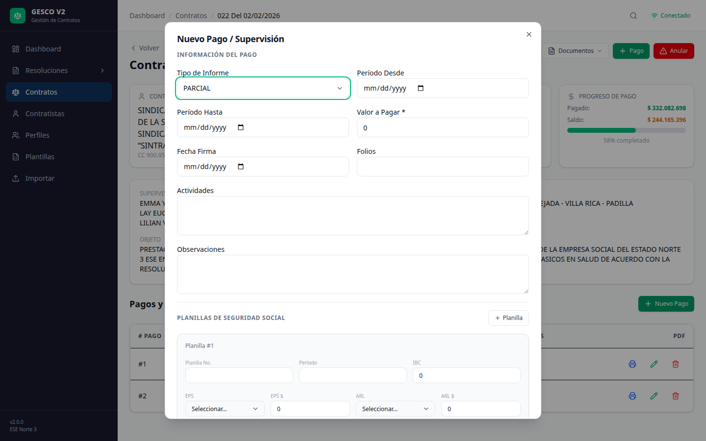

# Manual de Usuario — Gesco V2
## Sistema de Gestión de Contratos ESE Norte 3

---

## 1. ¿Qué es Gesco V2?

Gesco V2 es un sistema web para gestionar los contratos de prestación de servicios de la **ESE Norte 3**. Permite:

- Registrar y administrar **contratos** de profesionales de la salud
- Gestionar **pagos y supervisiones** con evaluación de actividades
- Descargar **documentos legales** (contrato, actas, certificados)
- Importar datos desde **archivos Excel**
- Administrar **perfiles profesionales** con sus actividades

---

## 2. Cómo acceder

Abre tu navegador (Chrome, Edge, Firefox) y ve a:

**https://contratos.esenorte3.lat**


Verás el panel principal con el resumen de contratos, resoluciones y alertas de vencimiento.

---

## 3. Panel Principal (Dashboard)

Cuando ingresas, lo primero que ves es el **Dashboard** con:

- **Resumen general**: número de resoluciones, contratos, presupuesto
- **Alertas**: contratos próximos a vencer en los próximos 30 días
- **Navegación lateral**: menú para acceder a todas las secciones

### Menú lateral

| Sección | Descripción |
|---------|-------------|
| Dashboard | Panel principal con indicadores |
| Resoluciones | Gestionar resoluciones presupuestales |
| Contratos | Listar, crear y gestionar contratos |
| Contratistas | Ver y editar datos de contratistas |
| Perfiles | Administrar perfiles profesionales |
| Plantillas | Plantillas de observación para supervisiones |
| Importar | Cargar datos desde Excel |

---

## 4. Resoluciones

Una **Resolución** es el acto administrativo que autoriza un presupuesto para contratar.

### Lista de resoluciones


### Crear una resolución

1. Ve a **Resoluciones** en el menú lateral
2. Haz clic en **Nueva Resolución**
3. Completa:
   - **Código**: ej. "RES-001-2026"
   - **Vigencia**: año (ej. 2026)
   - **Título**: descripción breve
   - **Presupuesto**: monto total asignado
   - **% Indirecto**: porcentaje para gastos indirectos (ej. 15)
4. Haz clic en **Guardar**

### Detalle de resolución


En el detalle ves la lista de contratos asociados y KPIs como:
- Total contratos, activos, anulados
- Presupuesto asignado y comprometido
- Saldo disponible

### Editar / Eliminar

- Desde el detalle, haz clic en **Editar** para modificar datos
- Haz clic en **Eliminar** para borrar (solo si no tiene contratos asociados)

---

## 5. Contratos

### Lista de contratos


En **Contratos** del menú lateral verás todos los contratos registrados. Puedes:

- **Buscar**: escribe número de contrato, nombre o cédula del contratista
- **Filtrar por estado**: ACTIVO, FINALIZADO, ANULADO
- **Filtrar por resolución**: selecciona una resolución específica

### Crear un contrato nuevo


1. Ve a **Contratos** → haz clic en **Nuevo Contrato**
2. **Buscar contratista**: escribe el nombre o CC del contratista. Si existe, se selecciona automáticamente. Si no, completa los datos manualmente.
3. **Completar datos del contrato**:
   - **Número de contrato**: ej. "001 del 01/02/2026"
   - **Resolución**: selecciona la resolución (opcional)
   - **Perfil**: selecciona el perfil profesional
   - **Valor Total**: monto del contrato
   - **Supervisor**: nombre del supervisor
   - **Fecha inicio / Fecha fin**: período de vigencia
   - **Objeto**: descripción del servicio
4. Haz clic en **Crear Contrato**

### Detalle del contrato


Haz clic en cualquier contrato de la lista. Verás:

- **Información general**: contratista, valor, fechas, supervisor
- **Progreso de pago**: barra que muestra cuánto se ha pagado vs el total
- **Lista de pagos**: tabla con todos los pagos registrados
- **Botones para acciones**: Editar, descargar documentos, registrar pago, anular

### Editar un contrato

Desde el detalle, haz clic en **Editar**. Puedes modificar:
- Estado, perfil, valor, fechas
- Supervisor, CDP, rubro
- Objeto del contrato

### Descargar documentos

Desde el detalle del contrato hay dos botones:


| Botón | Qué descarga |
|-------|-------------|
| **Contrato** | El contrato en Word (.docx) con todas las cláusulas legales |
| **Documentos ▼** | Menú desplegable con 8 documentos |

Los documentos disponibles son:

| Documento | Para qué sirve |
|-----------|---------------|
| Inexistencia | Certificado de que no hay personal disponible |
| Estudios Previos | Estudio previo de la contratación |
| Solicitud CDP | Solicitud de disponibilidad presupuestal |
| Invitación | Invitación formal a contratar |
| Idoneidad | Certificado de idoneidad del contratista |
| Designación | Designación del supervisor del contrato |
| Acta Inicio | Acta de inicio del contrato |
| Acta Liquidación | Acta final de liquidación del contrato |

---

## 6. Contratistas

### Buscar un contratista


1. Ve a **Contratistas** en el menú lateral
2. Escribe el nombre o número de cédula en el buscador
3. Los resultados aparecen automáticamente

### Ver detalle / Editar


Haz clic en un contratista para ver sus datos:
- Nombre, identificación, tipo de persona, teléfono, dirección
- **Contratos asociados**: lista de todos los contratos de ese contratista

Para editar, haz clic en **Editar** y modifica los campos necesarios.

---

## 7. Perfiles

Los **Perfiles** son los cargos profesionales (MEDICINA, ENFERMERIA, PSICOLOGIA, etc.). Cada perfil tiene:

- **Objeto del contrato**: texto base para los contratos de ese perfil
- **Obligaciones**: lista de obligaciones generales
- **Actividades**: lista de actividades que el profesional debe cumplir

### Lista de perfiles


### Gestión de perfiles

1. Ve a **Perfiles** en el menú lateral
2. Verás tarjetas con todos los perfiles registrados
3. Haz clic en un perfil para editarlo

#### Pestañas del perfil:


| Pestaña | Qué contiene |
|---------|-------------|
| **Objeto del contrato** | Texto del objeto contractual. Se usa al crear contratos |
| **Obligaciones** | Lista de obligaciones. Puedes agregar, editar y eliminar |
| **Actividades** | Lista de actividades con su tipo |

#### Tipos de actividad:

- **GENERAL** (azul): obligaciones generales del contratista
- **ESPECÍFICA** (ámbar): obligaciones específicas según el perfil

Al agregar una actividad, selecciona GENERAL o ESPECÍFICA. Puedes cambiar el tipo haciendo clic en el texto de la actividad y editándolo inline.

### Crear un nuevo perfil

Haz clic en **Nuevo Perfil**, escribe el nombre y el objeto, luego agrega las actividades desde la pestaña correspondiente.

### Actividades en el contrato DOCX

Cuando descargas el contrato en Word, las actividades aparecen así:

```
OBLIGACIONES GENERALES:
1. Realizar la identificación integral del riesgo...
2. Ejecutar las atenciones individuales...
...

OBLIGACIONES ESPECÍFICAS:
37. Realizar un total de 540 atenciones...
    GRUPO ETAREO | ATENCIÓN | No.
    ADULTEZ     | CONSULTA | 100
...
```

---

## 8. Pagos y Supervisiones

### Registrar un pago



1. Ve al detalle del contrato
2. Haz clic en **Pago**
3. Completa el formulario:
   - **Tipo de Informe**: PARCIAL o FINAL
   - **Período Desde / Hasta**: fechas del período evaluado
   - **Valor a Pagar**: monto del pago
   - **Actividades / Observaciones**: notas relevantes
4. **Evaluar actividades**: cada actividad del perfil aparece con opción **Cumple** ✅ / **No Cumple** ❌
5. Si el pago cubre el saldo total, aparecerá la opción **"Finalizar contrato al registrar este pago"**
6. Haz clic en **Registrar Pago**

### Editar un pago

En la tabla de pagos, haz clic en el ícono de **lápiz** ✏️. Puedes modificar todos los datos del pago.

### Eliminar un pago

Haz clic en el ícono de **basurero** 🗑️ y confirma la eliminación.

### Descargar PDF de supervisión

En la tabla de pagos, haz clic en el ícono de **impresora** 🖨️ para descargar el informe de supervisión en PDF. El PDF incluye:

- Datos del contrato y del contratista
- Tipo de informe (PARCIAL / FINAL)
- Valor a pagar en letras
- Actividades con marca de cumplimiento (✅)
- Planillas de seguridad social (EPS, ARL, AFP)
- Certificación del supervisor
- Firmas del supervisor y del contratista

---

## 9. Importar desde Excel


### Preparar el archivo

El Excel debe tener los siguientes encabezados (columnas):

| Columna | Descripción |
|---------|-------------|
| TIPO DE INFORME | PARCIAL o FINAL |
| N° DE CONTRATO | Número único del contrato |
| PERIODO INFORME DESDE | Fecha inicio del período |
| PERIODO INFORME HASTA | Fecha fin del período |
| NOMBRE CONTRATISTA | Nombre completo |
| No. DE IDENTIFICACIÓN | CC o NIT |
| EXPEDIDA EN | Lugar de expedición |
| PERFIL | Nombre del perfil |
| VALOR A PAGAR | Monto del pago |
| PAGO No | Número del pago |

### Importar

1. Ve a **Importar** en el menú lateral
2. Selecciona la **resolución** a la que pertenecerán los contratos
3. Selecciona el archivo Excel (.xlsx)
4. Haz clic en **Importar**
5. El sistema te mostrará cuántos contratos y pagos se crearon

**Notas importantes:**
- Si un contrato ya existe, solo se crea el pago (no se duplica el contrato)
- Los perfiles se normalizan automáticamente (ej. "MÉDICO GRAL" → "MEDICINA")
- Si el valor a pagar es $0, no se registra el pago (el contrato sí se crea)
- Las actividades del perfil se asignan automáticamente al contrato

---

## 10. Progreso de pago

Cada contrato muestra una tarjeta de **Progreso de Pago** con:

- **Pagado**: suma de todos los pagos registrados
- **Saldo**: valor del contrato menos lo pagado
- **Barra de progreso**: porcentaje visual de avance

El progreso se calcula automáticamente: no necesitas hacer nada, solo registrar los pagos.

---

## 11. Consejos útiles

- ✅ **Revisa el perfil** del contratista antes de importar — las actividades del perfil determinan lo que se evalúa en las supervisiones
- ✅ **Contratos con slashes**: los números como "022 del 02/02/2026" se manejan solos
- ✅ **Para ver contratos de un contratista**: ve a Contratistas, busca, y en su detalle verás todos sus contratos
- ✅ **Actividades en PDF**: al descargar el contrato DOCX, las actividades aparecen numeradas con su tipo (GENERAL/ESPECÍFICA)
- ✅ **Marcar actividades**: en el pago, cada actividad tiene su checkbox Cumple/No Cumple
- ✅ **Finalizar contrato**: marca la casilla al hacer el último pago

---

## 12. Solución de problemas comunes

| Problema | Causa posible | Solución |
|----------|--------------|----------|
| No encuentra un contratista | El nombre tiene errores ortográficos | Busca por número de cédula |
| El Excel no importa | Columnas incorrectas | Usa la plantilla original del proyecto |
| No aparecen actividades en supervisión | El perfil no tiene actividades | Ve a Perfiles y agrega actividades |
| El PDF no se descarga | Error temporal | Intenta de nuevo en 1 minuto |
| El contrato no aparece en la lista | Está filtrado por estado o resolución | Limpia los filtros |
| Error al guardar perfil | Actividad con tipo inválido | Solo usa GENERAL o ESPECÍFICA |
| Los documentos se descargan con `<< >>` | Placeholder sin reemplazar | Verifica que el contrato tenga todos los datos completos |

---

*Documento generado el 02 de julio de 2026 — Gesco V2 ESE Norte 3*
